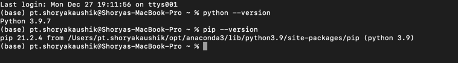

**Project setup:**

 - First install python3 in your system
 - After installing set the environment variable 
path(if Windows) and set .zsh profile paths(if MacOS catalina or higher).
 - After variable setup open cmd/terminal run command - python --version & pip --version.
 - Also install pyCharm Community based version.
 
 

 - As shown in the Image - it should be shown like this, which means that our paths is set already.
 - Now we need to install *Selenium* using pip3
 - !pip install selenium
 - !pip install pytest
 - pip install allure-pytest
 - After that go to Settings(Windows) or Preferences(Macbook).
 - In those settings go Select Python Interpreter and click on plus icon.
 - After that install all the packages(installed by pip commands) UI based again by clicking on Install package after selecting every particular package.
 - Jinx: Project Setup completed

**Project Structure Description:**
 - Create python packages main and tests
 - Action for all - common python file to be in *main package*.
 - Pages and TestSpecs python packages to be in *tests package*.
 - Create test clases as per the convience.

**Action Page Description:**

click
 - Explicit wait
 - Click
 - logs in console printing

Clear the text/ input fields.
 - .clear
 - logs in console printing

Send keys
 - element.sendKeys(StringName)
 - Log in console printing

Scroll into View
 - wait for element and Scroll to the element
 - Log print

is Element present
 - Wait for element to be present - return type
 - Log print

wait for visibility
 - explicit wait
 - log print

